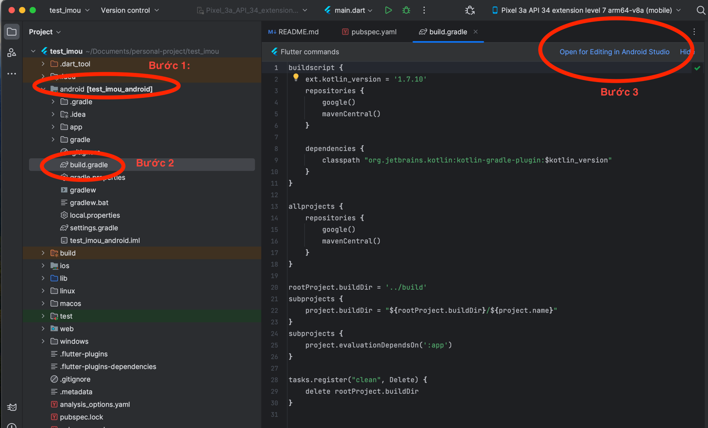
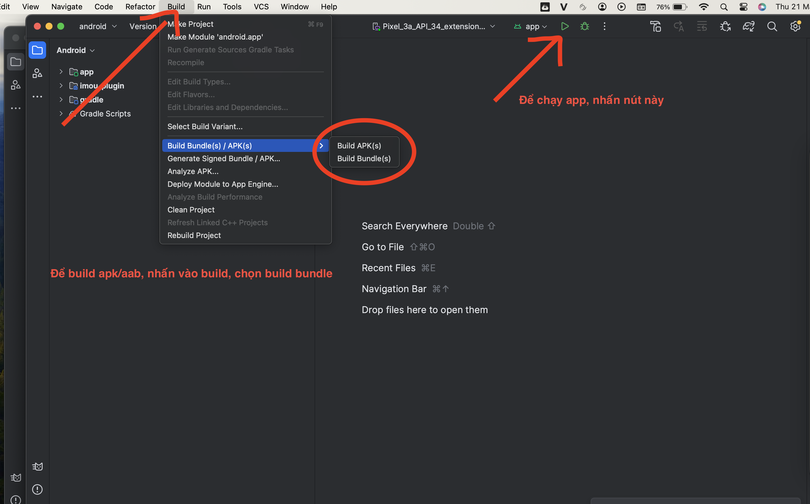

Hướng dẫn sử dụng sdk imou

## Import
### Build aar và test chức năng camera
- Để sử dụng sdk imou, do sdk là file aar và phía imou không đưa lên maven nên không thể hỗ trợ import như bình thường
- Do đó, cần import 2 cách như sau:
- Cách 1: Import để test sdk và build ra file apk/aar
```yaml
dependencies:
  flutter:
    sdk: flutter
  imou_plugin: 
    git:
      url: https://github.com/thanhdang198/imou_flutter
      # ref: build
      ref: release
```
Chuyển `ref: release` để có thể chạy & test SDK

Hướng dẫn chạy, test và build app đẩy lên store trong trường hợp này:
Mở lần lượt các folder như bên dưới
B1. Mở folder `android`
B2. Mở file `build.gradle`
B3. Góc trên bên phải, nhấn vào open for editing in android studio như ảnh



Sau khi có cửa sổ android studio mới mở lên, bạn có thể chạy được project như sau:




### Build các chức năng khác không liên quan đến camera
- Sửa `ref: release` thành `ref: build` như hình và chạy project bình thường. Khi cần build aar để
đẩy lên store, chuyển lại thành release như trên
```yaml
dependencies:
  flutter:
    sdk: flutter
  imou_plugin: 
    git:
      url: https://github.com/thanhdang198/imou_flutter
      ref: build
#      ref: release
```

# Do hạn chế dung lượng của file aar quá lớn nên mình không thể hỗ trợ đưa lên các site free được.
